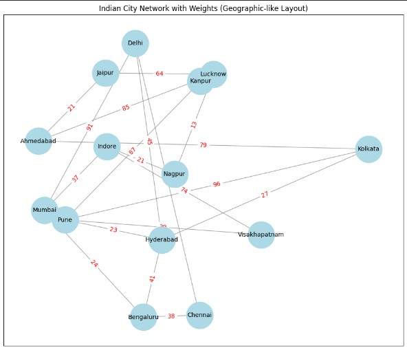
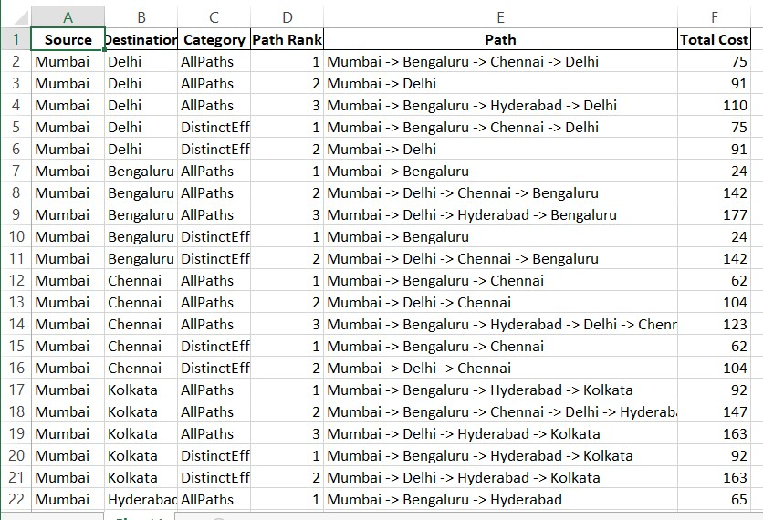

<h1 align="center">🌐 All-Pairs K-Shortest Paths with Distinct Effective Routing</h1>

<p align="center">
  
</p>

<p align="center">
  
  
  
  
</p>

---

## 📌 Project Overview
This project implements **All-Pairs K-Shortest Paths** in a **weighted undirected network graph** using Python and NetworkX.  
In real-world routing, a single shortest path is not reliable because if a link fails, the route may break.  
So, this project generates:

✅ **K shortest paths between every pair of nodes**  
✅ **Distinct Effective Paths** for **fault tolerance** (removes high-cost paths sharing same first-hop dependency)  
✅ Exports results in **CSV and Excel** formats for analysis and documentation  

---

## 🖼️ Project Poster / Concept Diagram


---

## 🎯 Objectives
- To model a real-world network as a **weighted graph**
- To compute **All-Pairs K shortest loopless paths**
- To generate **Distinct Effective Paths** for fault tolerant routing
- To export the output into **CSV and Excel** files
- To download files directly in **Google Colab**

---

## 🧠 Key Concepts Used
- Graph Theory (Nodes, Edges, Weights)
- K Shortest Path Routing
- Fault-Tolerant Routing Concept
- Weighted shortest path computation

---

## 🕸️ Input Graph (Network Topology)
Below image shows the weighted network graph used for routing:



---

## ⚙️ Methodology / Workflow

### ✅ Step-by-step workflow:
1. Create weighted network graph (nodes & edges)
2. Visualize network topology
3. Take input value `K`
4. Compute K shortest paths between all node pairs
5. Apply filtering to generate **Distinct Effective Paths**
6. Save results to CSV and Excel
7. Download output files from Colab

---

## 🔥 Distinct Effective Paths (Fault Tolerance Explanation)
Sometimes multiple shortest paths depend on the same first-hop link, for example:

- Path 1: A → C → E → H → G
- Path 2: A → C → H → F → G
- Path 3: A → D → B → G

If the first-hop link **A → C** fails, then both path 1 and path 2 will fail ❌  
So we keep the **lowest-cost** dependent path and discard the other high-cost dependent path.

✅ This improves fault tolerance and provides more distinct backup routes.

---

## 📂 Output Files
Generated output files:

- `all_pairs_k_shortest_paths_distinct.csv`
- `all_pairs_k_shortest_paths_distinct.xlsx`

Each output contains:
- Source
- Destination
- Category (AllPaths / DistinctEffectivePaths)
- Path Rank
- Path
- Total Cost

---

## 📊 Output Preview (Excel Screenshot)


---

## ▶️ How to Run (Google Colab)

### ✅ Steps:
1. Open the notebook: `k_shortest_Path.ipynb`
2. Run all cells
3. Enter K value when asked
4. Output CSV/Excel files will be generated and downloaded automatically

---

## 🧾 Requirements
Install dependencies using:

```bash
pip install -r requirements.txt
